# Mix-It-Up-_Drink_Search_Tool
 
## Project Description
This webpage was created so a user could search for drinks and meals by entering an ingredient name. They will be presented with the names of meals or dirnks that include the ingredient. When clicked, they can see more detailed info about that meal/drink.  
 
## Table of Contents
- [Installation](#installation)
- [Criteria Checks](#criteria)
- [Usage and Coding](#Usage/coding)
- [Screenshots](#screenshots)
- [Credits](#credits)
- [License](#license)
## Installation
Clone or download this repository on GitHub then open "edoliva.github.io/Mix-It-Up-_Drink_Search_Tool" in a browser.  
## Criteria
- The user must enter the name of a an ingredient to search for a meal or drink. As more ingredients are searched, the names are rendered in the "Your searches" section. The previous 7 searches will be rendered.
- If the user enters an invalid ingredient name then no meals/drinks data will be displayed.
- Previous searches can be re-searched by clicking on their name on the left column.
- The user may clear all previous searches from local storage.
- Within the recipe, the user may click on additional ingredients to search.  
## Usage/coding:
- This HTML, CSS and JS were written to allow for a clean user experience. The general logic is as follows:
   - The left cloumn displays an input that saves the ingredient names to local storage in an array.
   - The API URL is updated to include the most recently entered ingredient. The city name is dynamic and will be the most recent user ingredient entry. 
   - Invalid entries will yield no result.
   - The url will link to an array of objects that represent all the meals in the API which include the searched ingredient.
   - Variables are created that will reference specific items in the array. These items are then rendered by using document.querySelector. 
   - The meal icons are displayed by pulling the "image" code that updates a url and the meal name. API's hosted by www.themealdb.com/api.php and www.thecocktaildb.com/api.php.
   - When a user clicks on their saved searches it acts as though this is a new search, and enters that ingredient name as the most recent ingredient in the local storage array.
   - The user can click on the "Clear search history" button and it will clear the locally saved items. 

- Recipe information:
   - Once the user clicks on a meal or drink recipe name they like, they are presented with a meal/drink picture, a brief description, cooking/mixing instructions, a YouTube video(for the meal), and a list of all the ingredients included in that meal/drink.
   - The listed ingredients clickable buttons and will search that ingredient.
   - As with any other search input, it will present the user with a list if meals that include that ingredient.
   - Rinse, repeat.   
 
## Screenshots

Homescreen:
-
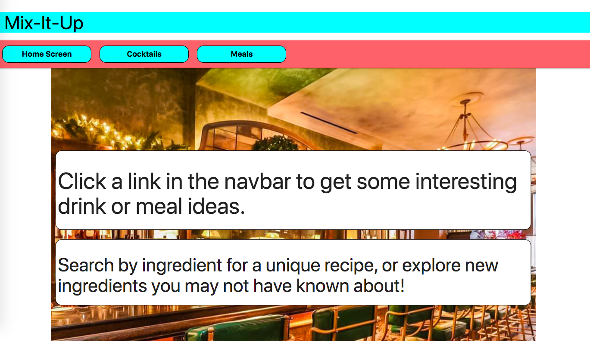
-
Cocktails (no past search history):  
-
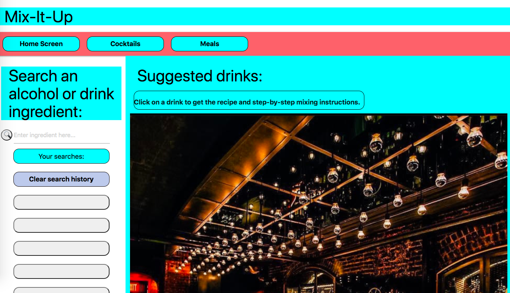
-
Cocktails - Gin search:
-
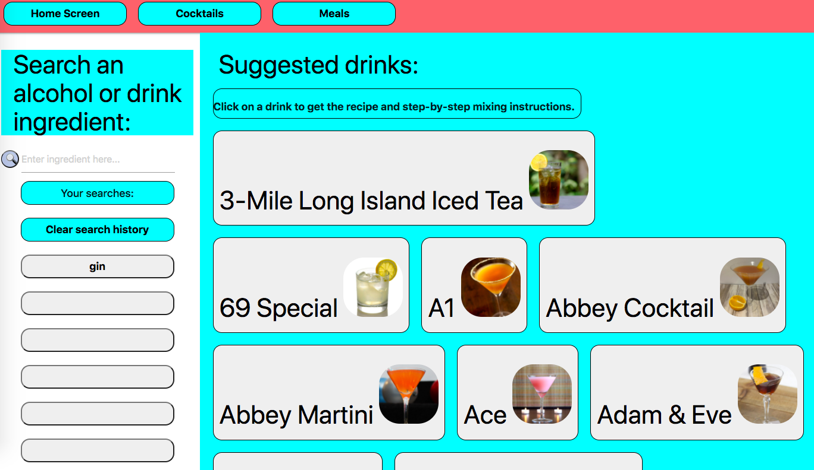
-
Cocktails - Recipe for the Abbey
-
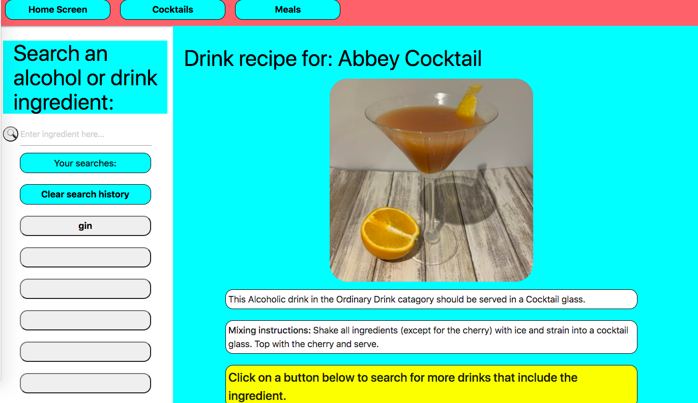
-
Cocktails - The Abbey Ingredients  
-
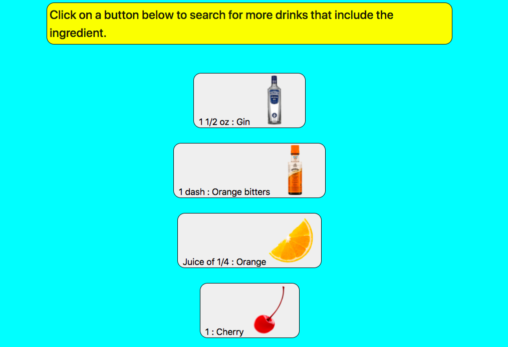   
-
Cocktails - Orange Bitters search. By clicking on the ingredient in the recipe, the user now searches all drinks with that ingredient:  
-
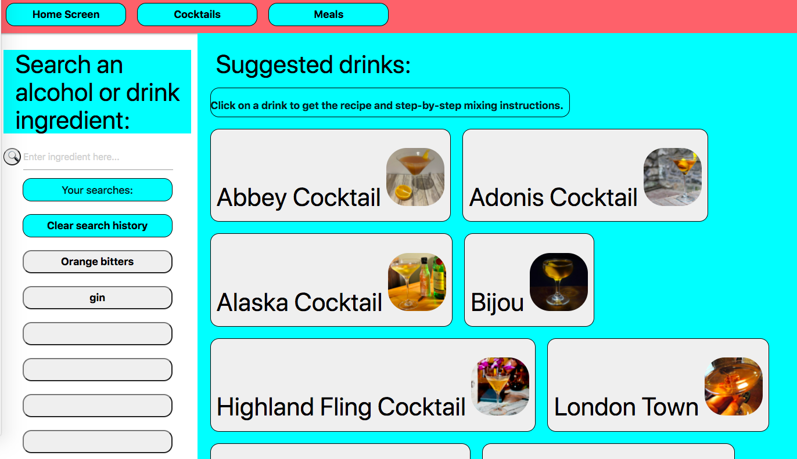 
-
Meaks (no past search history):  
-
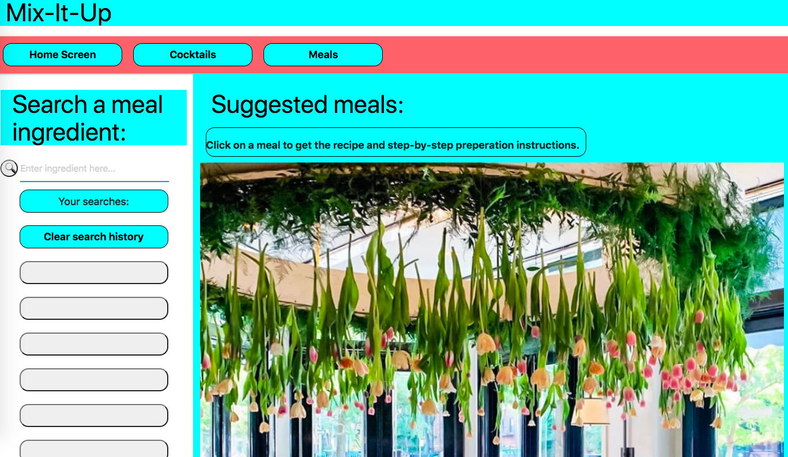
- 
Meals - Salmon search:
-
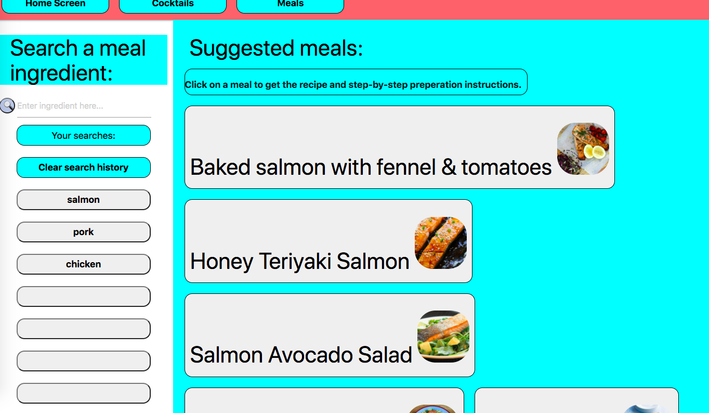  
-
Meals - Recipe for the Salmon Prawn:
-
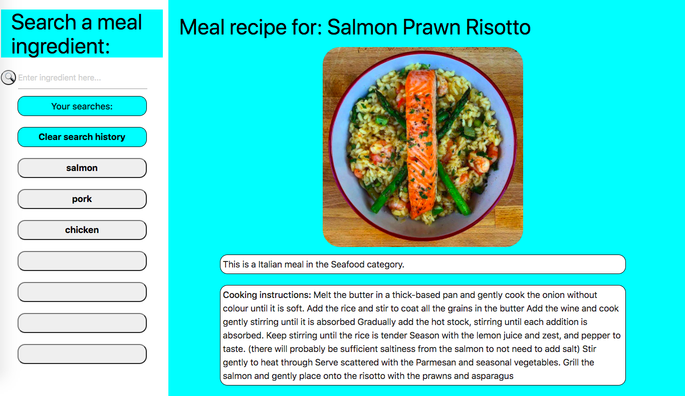 
-
Meals - Recipe for the Salmon Prawn YouTube video:
-
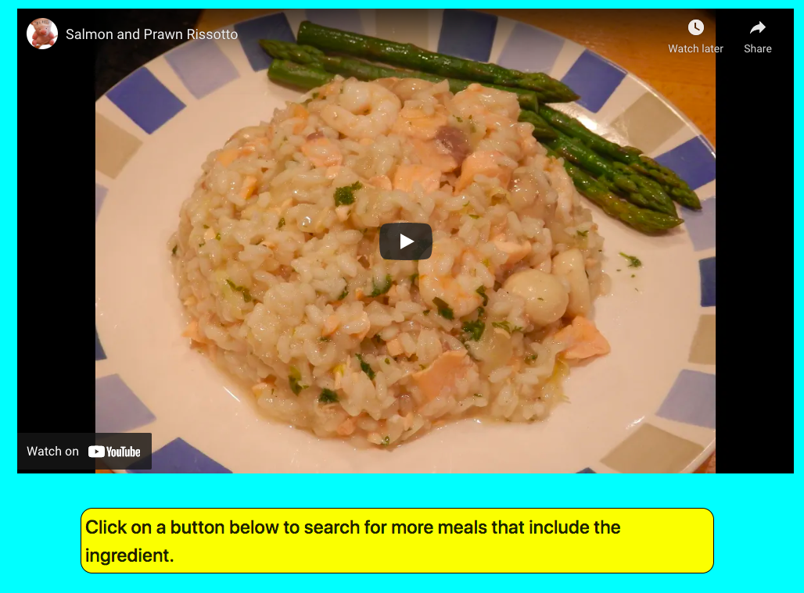 
-
Meals - Recipe for the Salmon Prawn ingredients
-
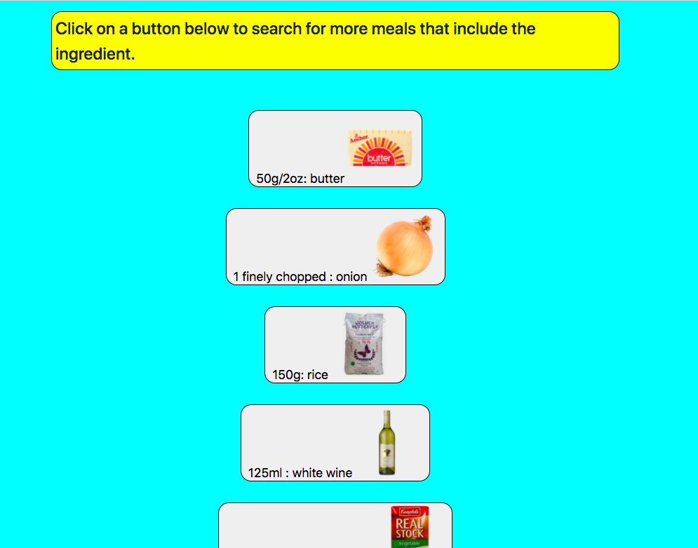 
-
 
## Credits
Shoutout to our instructor Anthony and TA Tom! As well as everyone at Trilogy Education for making the content and grading our assignments.
 
## License
© 2021 Ed Oliva, Sandy Pant, Nick Long.
Confidential and Proprietary. All Rights Reserved.
---
